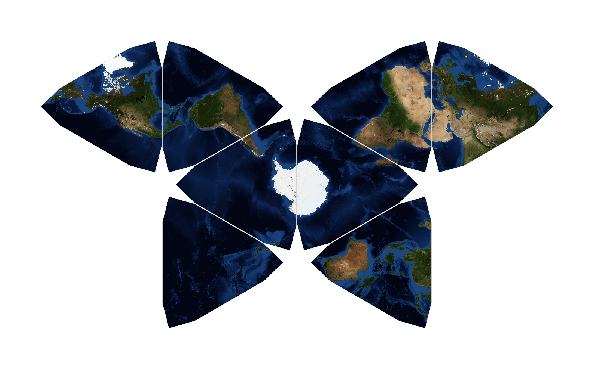

# map

Hey, this is my hobby project where I wrote some python code which performs a [polyhedral projection](https://en.wikipedia.org/wiki/Polyhedral_map_projection) to create my "own" map, similar to the [Waterman Butterfly](https://en.wikipedia.org/wiki/Waterman_butterfly_projection).

This code is capable of projecting even larger basemaps from equirectangular to your own polyhedral projection. For details, check the [manual](./doc/maunual.md).

## Quickstart

1. Create the image directories in your repo:

    * images
        * base
        * leafs
            * png
            * svg

2. Download a basemap (this [source](https://visibleearth.nasa.gov/collection/1484/blue-marble) can work well for a first try).

3. Edit the "Basemap" path in the [default config](./configs/quick.yaml)

4. Press run and have fun :)