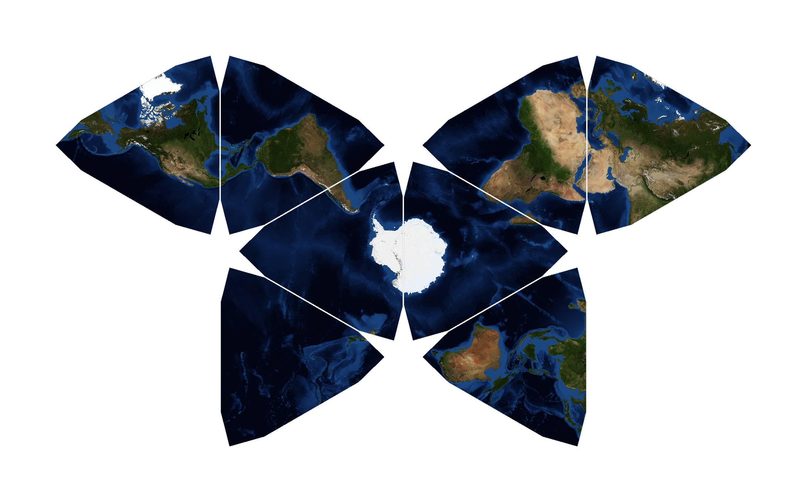
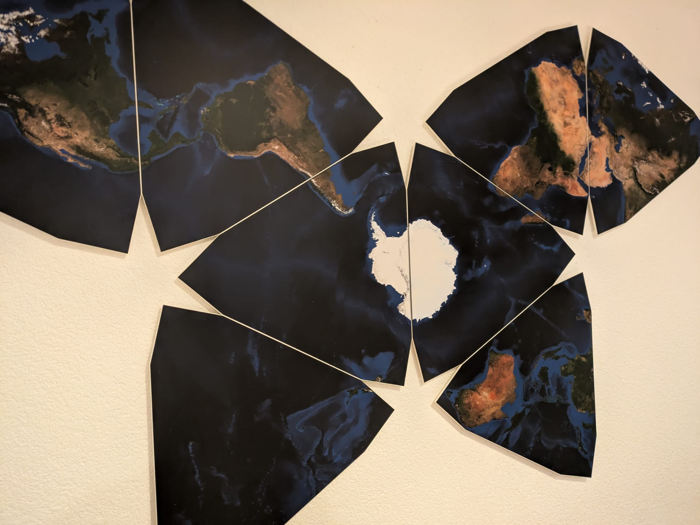
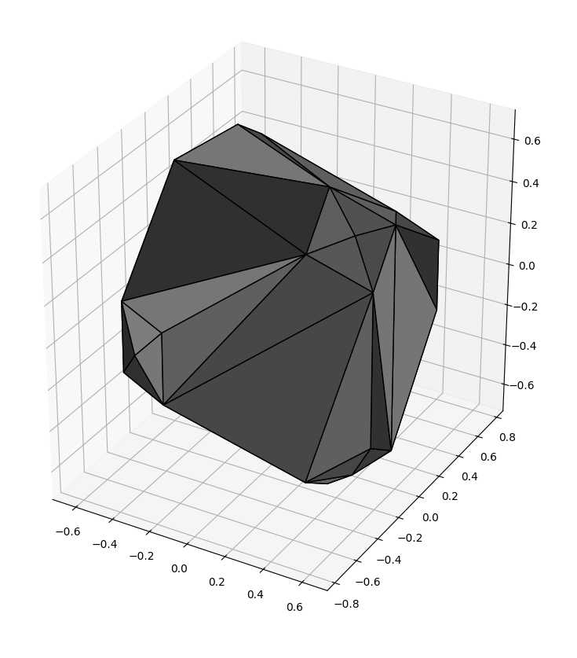
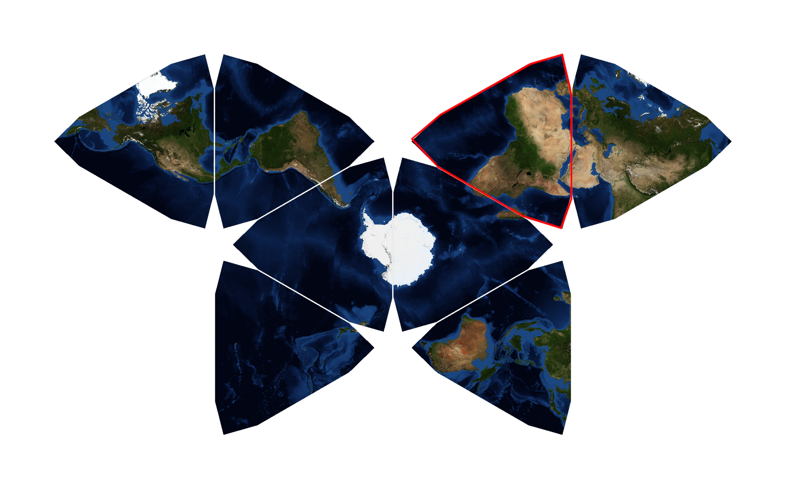
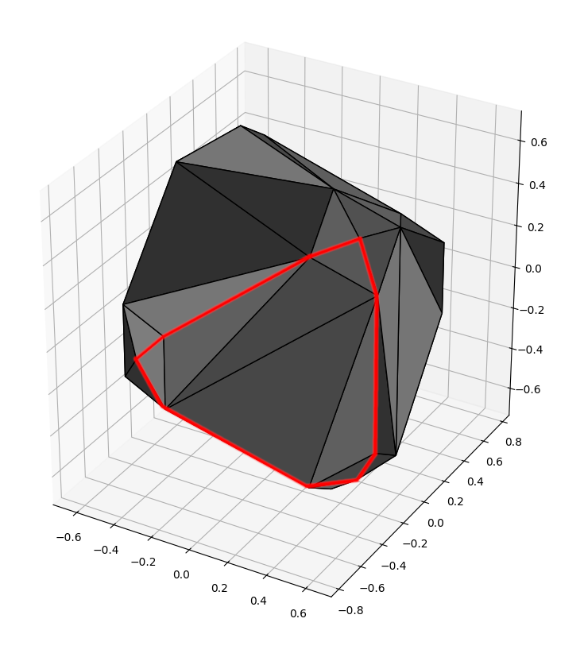
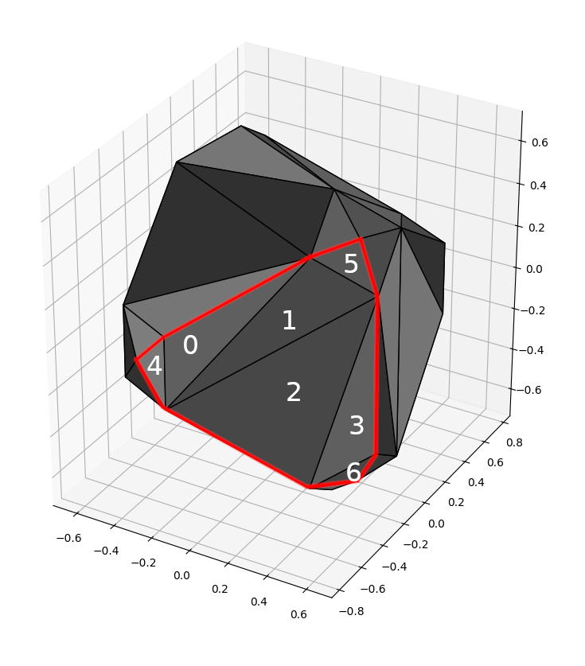
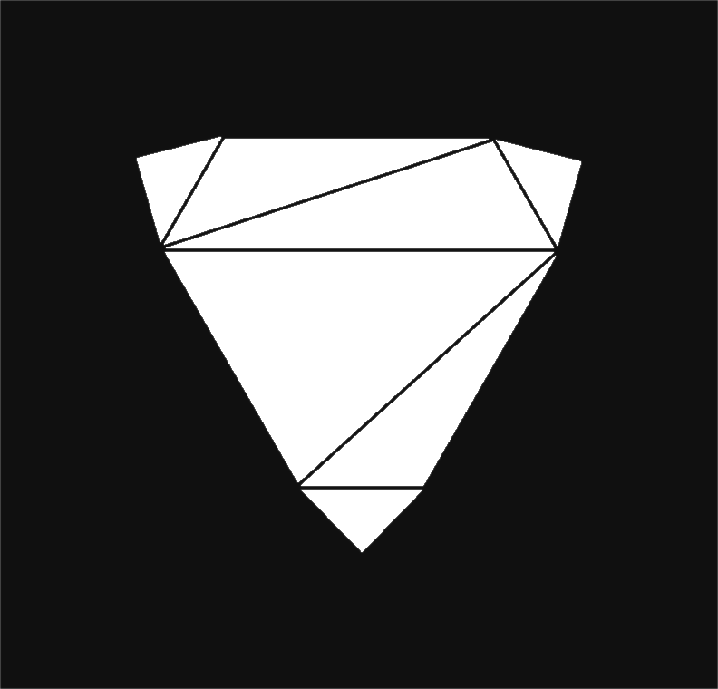

# Timo's Butterfly

 

Based on [Waterman Butterfly map projection](https://en.wikipedia.org/wiki/Waterman_butterfly_projection), which is objectively one of the coolest map projections, I decided to do my own and hang it in my living room wall. Here is how I did that:

## Result

Printing and and cutting has been done via a service provider.

## How To

### The solid

Here is the idea: We want to project the earth down to a solid that looks like this. This solid is a "not so pointy" octahedron. The shape itself unfolds to the butterfly from above like this:

This "leaf" of the map is made by projecting the earth on this "leaf" on the soild:

If you wonder why we call it a leaf and not a face, that we triangulate the surface of the solid into actual faces. You can see the triangles in the picture above.

Going with these vocabs we can see that each leaf consists of 7 (triangular) faces. We numerate them as follows:

Talking about vocabs, the red line is called the outline of the leaf.

### The basemap

So we now know how to build the solid. How do we project the eart onto it? Well first of all you need a "basemap", like satellite imagery. I used NASA's [Blue Marble](https://visibleearth.nasa.gov/collection/1484/blue-marble), but any map in equirectangular projection projection works.

### The actual projection

1. **Project each leaf onto a canvas**: So first, we create a canvas on which we want to paint or leaf. We then project our leaf from the solid down to this canvas. It would then look like this:

2. **Find all pixels that belong to a face**: Next we iterate through all faces (triangels) and find all pixels that belong to the face. We do this via barycentric coordinates - calculate the barycentric coordinates for all pixels, keep the pixels where all three components are positive.

3. **Find the lattitude and longitude for each pixel**: The barycentric coordinates work on both 2D and the actual solid. By knowing the barycentric coordinates of each pixel on the canvas, we know their position on the solid. We use this to then translate them to spherical coordinates.

4. **Sample from the basemap**: Having the lattitudes and longitudes, we now where to sample the RGB values from the basemap. Since we required the basemap to be in equirectangular projection, this is quite simple.

We then save the rendered images as png, their outlines as  svg

### Printing and cutting

I then looked for services online which do both cutting and printing. It helped that I prepared the images in PDFs using [Scribus](https://de.wikipedia.org/wiki/Scribus), combining the image and the outline.

That's it, we're done! If you have questions, feel free to hit me up :)

